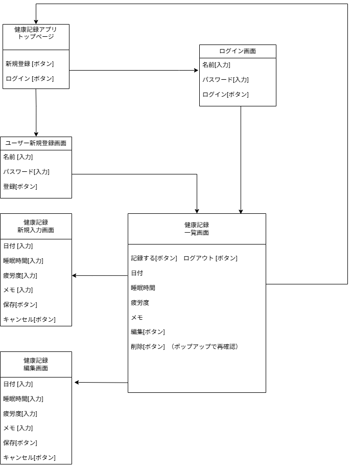
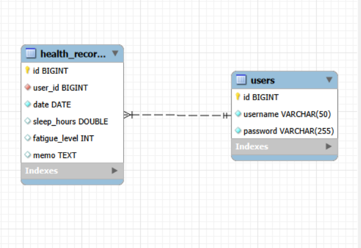

# 健康記録アプリ

## アプリ概要
日々の健康記録（睡眠時間・疲労度・メモ）を管理するWebアプリケーションです。

## 使用技術
| カテゴリ | 技術 |
|---|---|
| バックエンド  | Java 21, Spring Boot 4.1.0, Spring Security, Spring Data JPA |
| データベース  | MySQL（ローカル）/ MariaDB（本番） |
| フロントエンド | Thymeleaf, Bootstrap 5.3.8 |
| インフラ | AWS Lightsail |
| バージョン管理 | Git, GitHub |
| 開発環境 | IntelliJ IDEA, Windows 11 |

## 機能一覧
- ユーザー登録・ログイン・ログアウト
- 健康記録の一覧表示
- 健康記録の新規登録
- 健康記録の編集
- 健康記録の削除（確認モーダル付き）
- 入力値バリデーション

## 画面遷移図


## ER図


## 環境構築手順
### 必要な環境
- Java 21
- MySQL 8.0以上
- Maven

### 手順
1. リポジトリをクローン
```bash
git clone https://github.com/sakuma-s/health-tracker.git
```

2. データベースを作成
```sql
CREATE DATABASE health_tracker;
```

3. application.propertiesを作成
`src/main/resources/application.properties`に以下を記載:
```properties
spring.datasource.url=jdbc:mysql://localhost:3306/health_tracker
spring.datasource.username=your_username
spring.datasource.password=your_password
spring.jpa.hibernate.ddl-auto=update
spring.mvc.format.date=yyyy-MM-dd
```

4. アプリを起動
```bash
# Mac/Linux
./mvnw spring-boot:run

# Windows
mvnw spring-boot:run
```

## デプロイURL
[http://54.199.112.224:8080](http://54.199.112.224:8080)

## テストアカウント
| ユーザー名 | パスワード |
|-------|---|
| さはら   | 123 |
