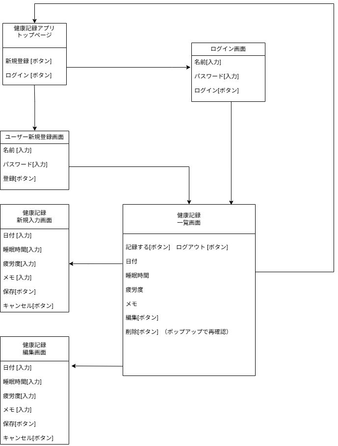
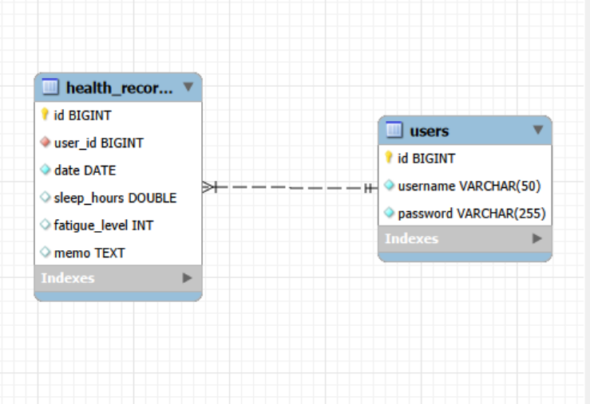

# 健康記録アプリ(随時更新中)

## アプリ概要
日々の健康記録（睡眠時間・疲労度・メモ）を管理するWebアプリケーションです。

## 使用技術
| カテゴリ    | 技術                                                          |
|---------|-------------------------------------------------------------|
| バックエンド  | Java 21, Spring Boot 4.1.0, Spring Security, Spring Data JPA |
| データベース  | MySQL（ローカル）/ MariaDB（本番）                                    |
| フロントエンド | Thymeleaf, Bootstrap 5.3.8, Chart.js, React, TypeScript      |
| クラウド    | AWS Lightsail                           |
| OS | Amazon Linux 2023                                           |
| バージョン管理 | Git, GitHub, GitHub Actions                                 |
| 開発環境    | IntelliJ IDEA, Windows 11                                   |

## 機能一覧
- ユーザー登録・ログイン・ログアウト
- 健康記録の一覧表示
- 健康記録の新規登録
- 健康記録の編集
- 健康記録の削除（確認モーダル付き）
- JSON APIによるメモキーワードのリアルタイム検索（React + TypeScript）※[フロントエンドリポジトリ](https://github.com/sakuma-s/health-tracker-front)
- 入力値バリデーション
- 睡眠時間は時間のみの入力にも対応（分は自動で0として保存）
## 画面遷移図


## ER図


## 環境構築手順
### 必要な環境
- Java 21
- MySQL 8.0以上
- Maven

### 手順
1. リポジトリをクローン
```bash
git clone https://github.com/sakuma-s/health-tracker.git
```

2. データベースを作成
```sql
CREATE DATABASE health_tracker;
```

3. application.propertiesを作成
`src/main/resources/application.properties`に以下を記載:
```properties
spring.datasource.url=jdbc:mysql://localhost:3306/health_tracker
spring.datasource.username=your_username
spring.datasource.password=your_password
spring.jpa.hibernate.ddl-auto=update
spring.mvc.format.date=yyyy-MM-dd
```

4. アプリを起動
```bash
# Mac/Linux
./mvnw spring-boot:run

# Windows
mvnw spring-boot:run
```

## デプロイURL
[http://54.199.112.224:8080](http://54.199.112.224:8080)

## テストアカウント
| ユーザー名 | パスワード |
|-------|---|
| さはら   | 123 |

## テスト

JUnit 5とMockitoを使用した単体テスト、およびMockMvcを使用したControllerのテストを実装しています。

### テスト対象

* `HealthRecordServiceImpl` の週平均計算ロジック
* `UserServiceImpl` のユーザー登録ロジック
* `HealthRecordController` の健康記録保存処理
* `HealthRecordController` の睡眠時間入力値変換ロジック

### テスト内容

**Service層**

* 週平均が正しく計算される
* レコードが空の場合に空リストを返す
* 今週のデータが集計対象外になる
* 複数週のデータがそれぞれ正しく計算される
* ユーザー名が重複している場合、登録に失敗する
* 新規ユーザーを登録できる

`resolveSleepTime` の入力値変換について、以下のパターンをテストしています。

* 時間のみ入力
* 時間・分ともに未入力
* 時間と分の両方を入力

**Controller**

MockMvcを使用してHTTPリクエストを発行し、Controllerの処理とレスポンスを確認しています。

* 新規登録フォームへのGETリクエストで200が返る
* 睡眠時間を時間のみ入力した場合、分を0として保存処理に渡す
* 睡眠時間を未入力にした場合、nullとして保存処理に渡す

### 実行方法

```bash
./mvnw test
```


### 自動化
GitHub Actionsを使用し、mainへのpush/PR時にテストを自動実行しています。

### 実行方法
```bash
./mvnw test
```